# Auth0 SSO with Spring Boot (with Docker and Kubernetes deployment)
#   # Docker and Kubernetes deployment
### Docker
#### Build with Gradle and Docker
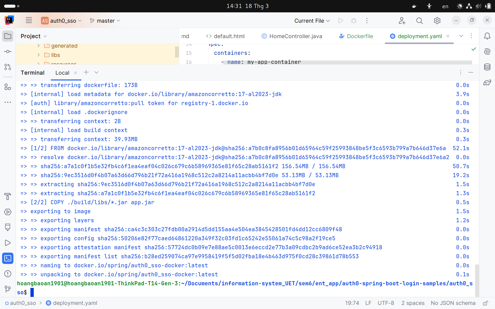
Image will shows up in Docker Desktop
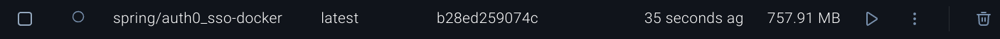
### #Run container on Docker Desktop
Forward the exposed port (3000)
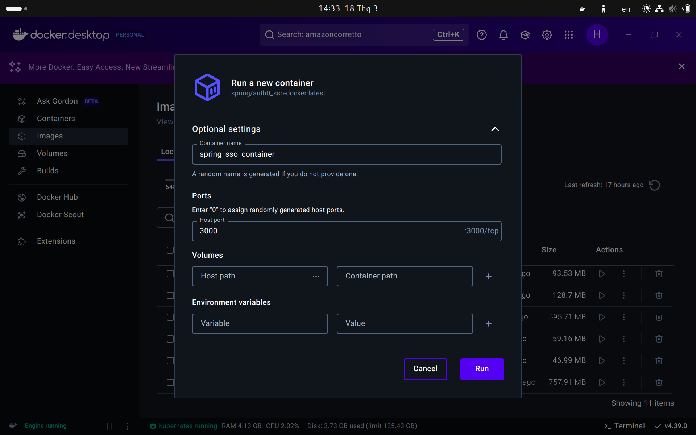
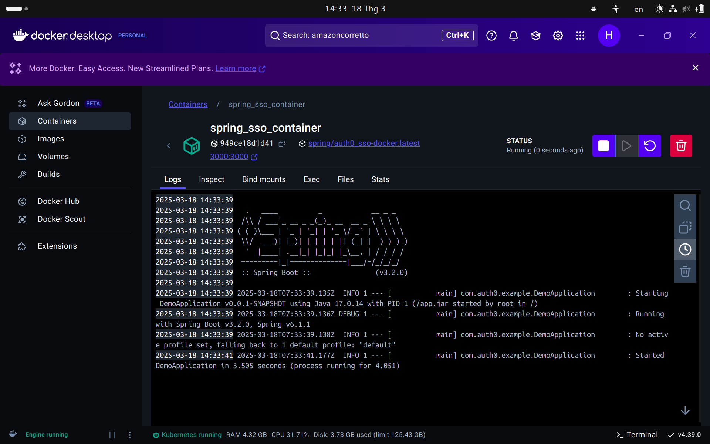
### Kubernetes
#### Enable Kubernetes on Docker Desktop
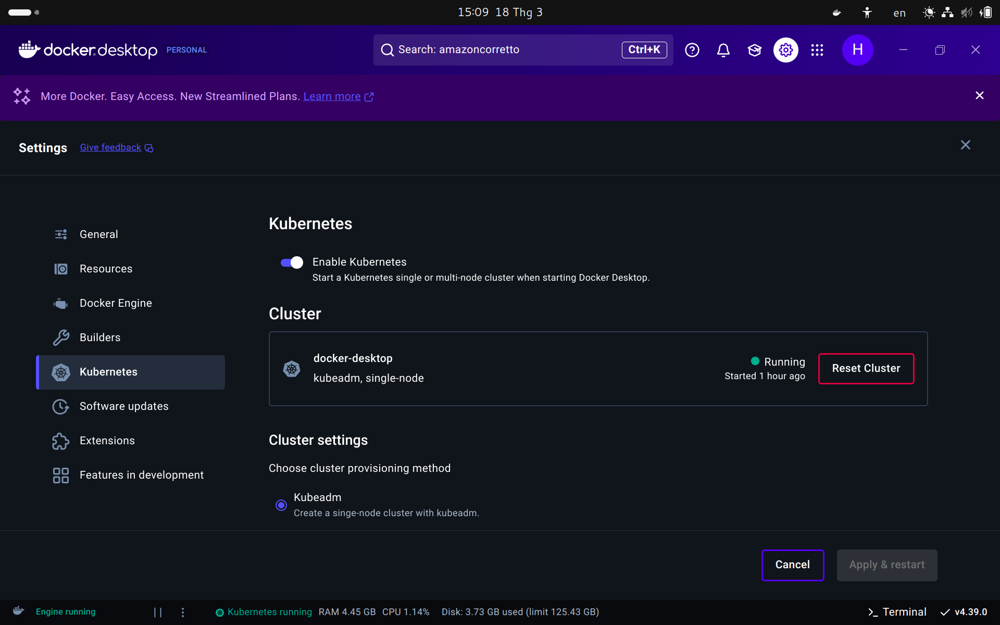
#### Create `deployment.yaml` and deploy on Kubernetes
```yaml
apiVersion: apps/v1
kind: Deployment
metadata:
  name: my-app-deployment
spec:
  replicas: 1
  selector:
    matchLabels:
      app: my-app
  template:
    metadata:
      labels:
        app: my-app
    spec:
      containers:
        - name: my-k8s-app-container
          image: spring/auth0_sso-docker:latest
          imagePullPolicy: Never
          ports:
            - containerPort: 3000
```
Note: use `imagePullPolicy: Never` to declare that the image is pulled from local docker, not Docker Hub.
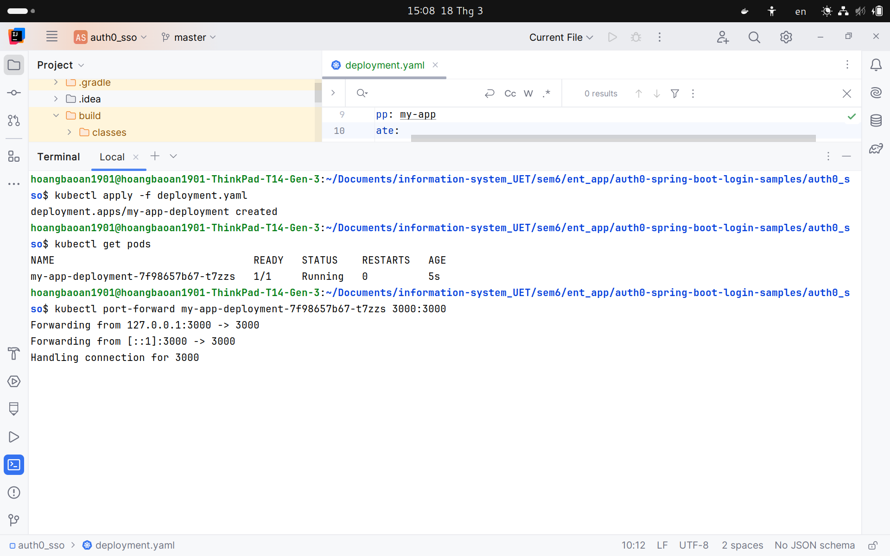
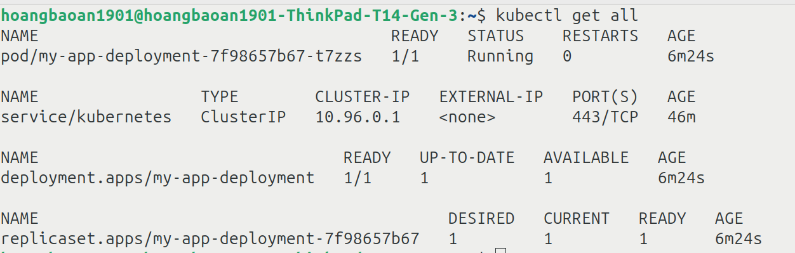
Result
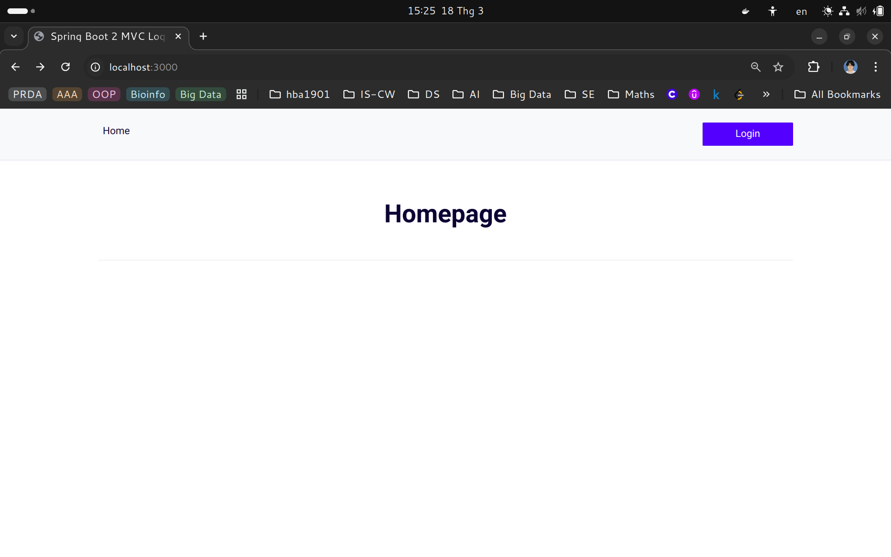
## 1. Homepage
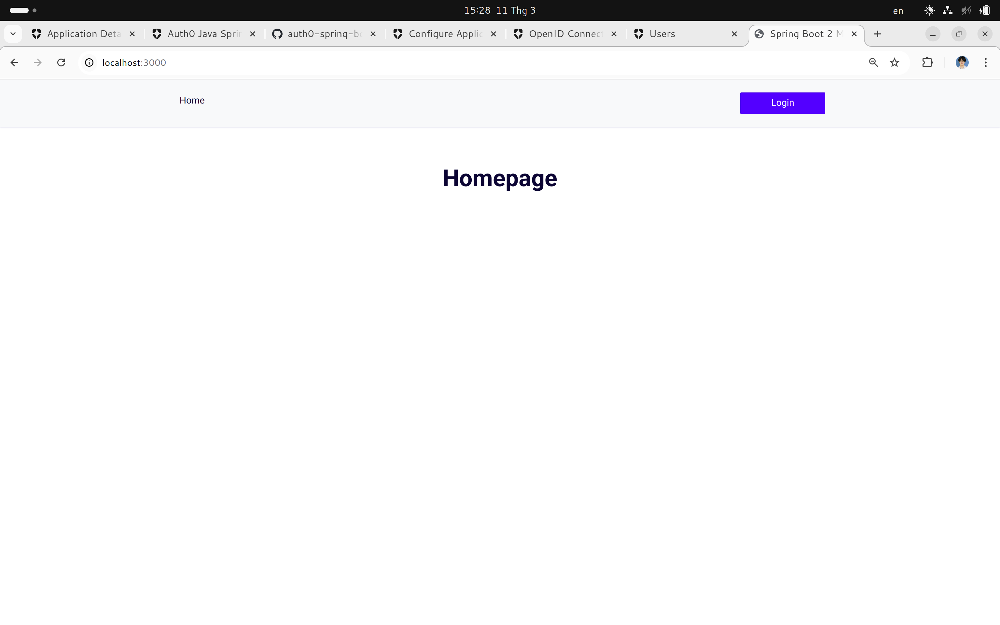
## 2. Login page with Auth0 service
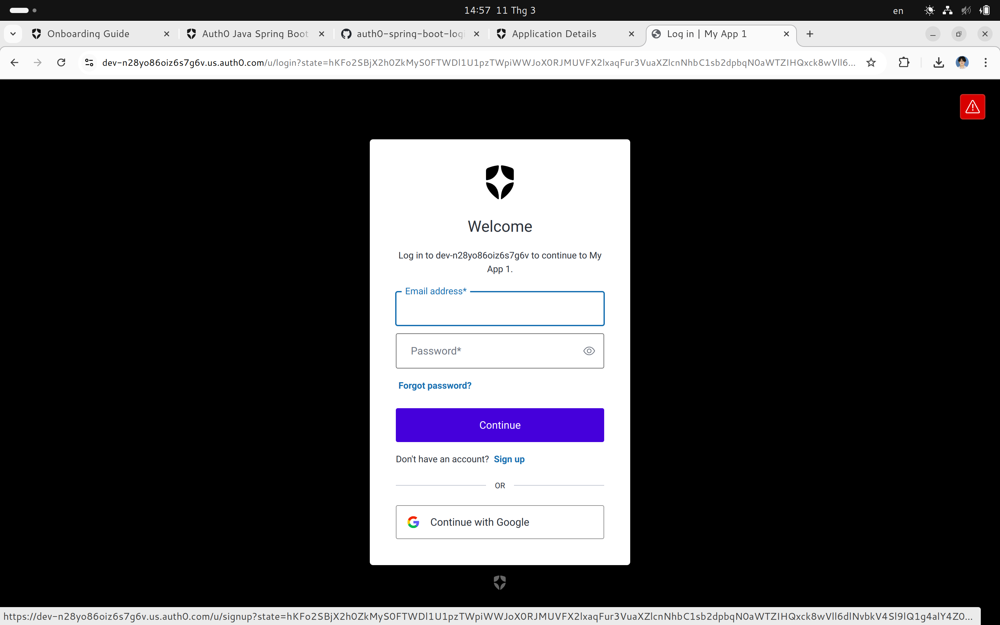
## 3. Sign up
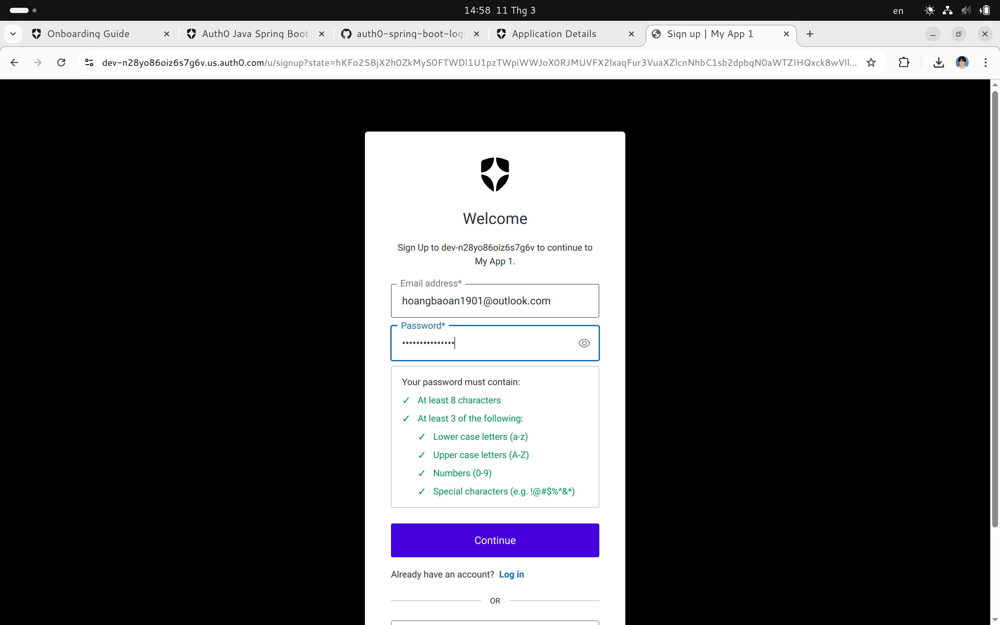
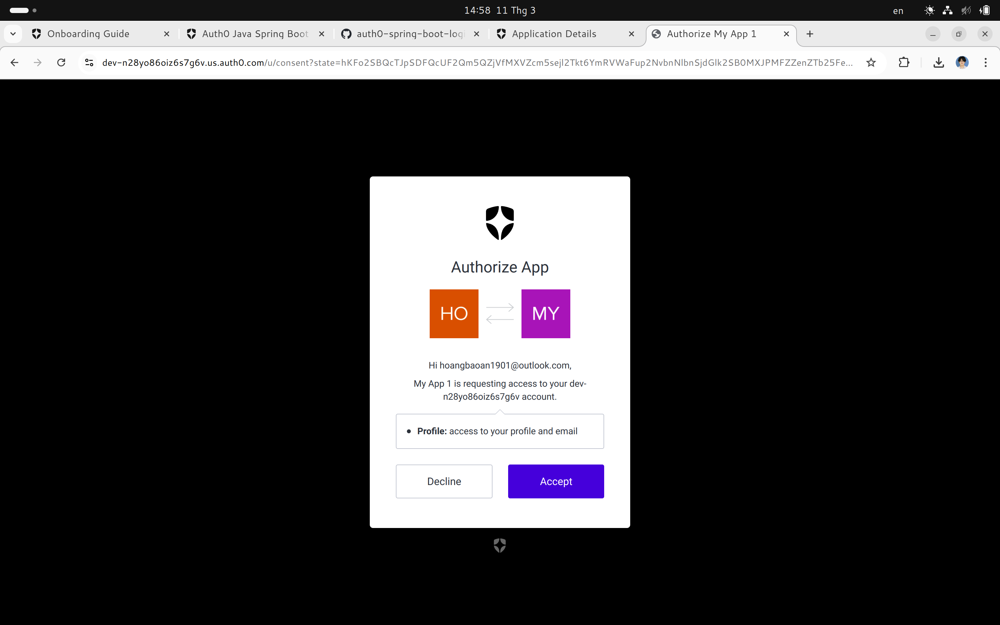
### Through Gmail
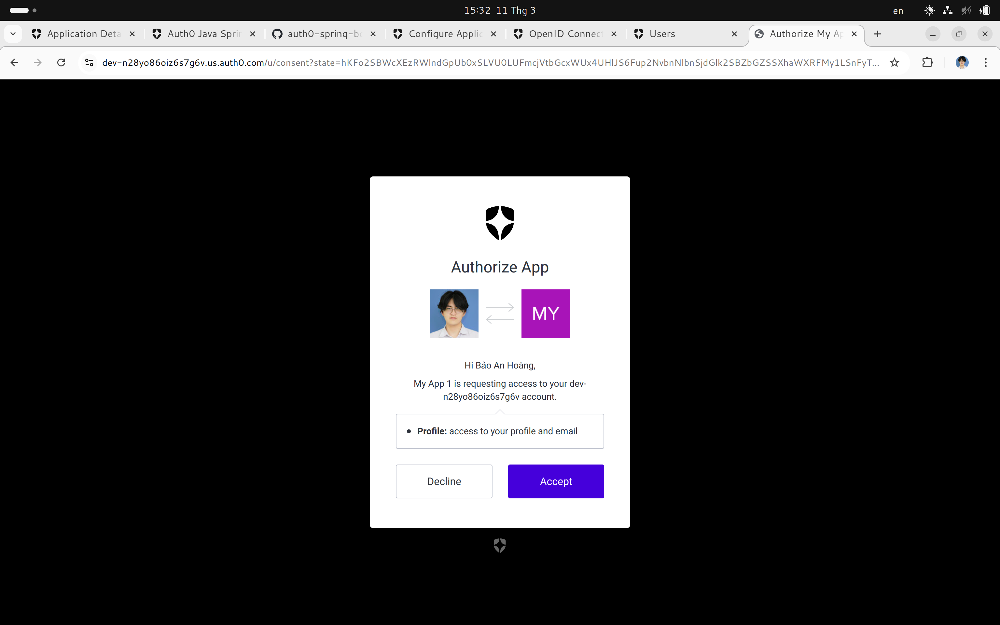

## 4. Homepage after sign in
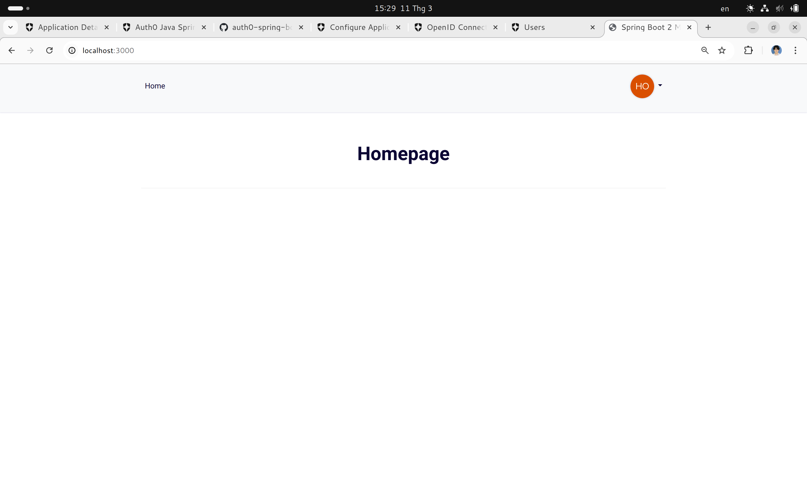
## 5. Profile page
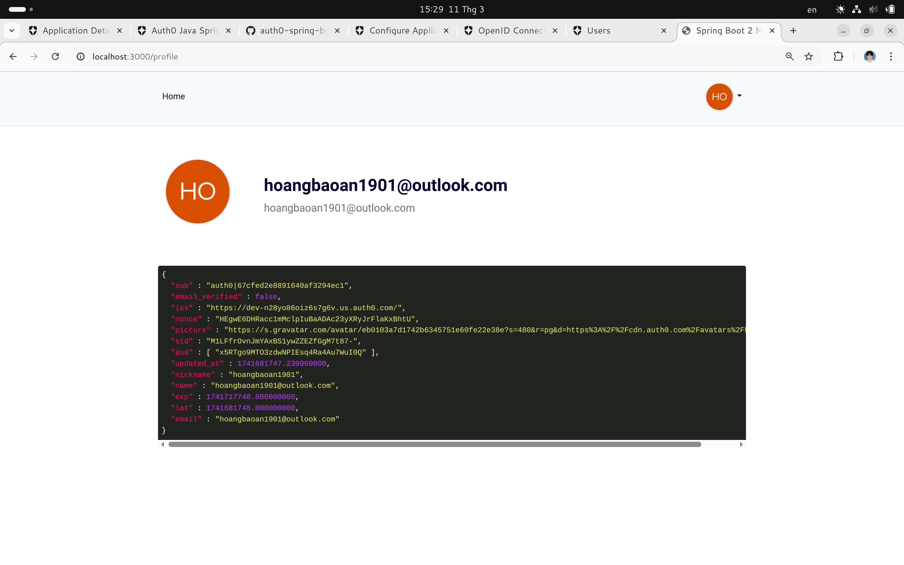
### With Gmail
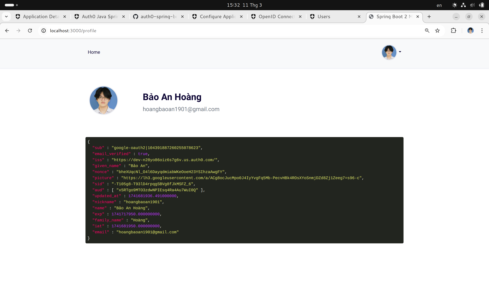
## 6. User management
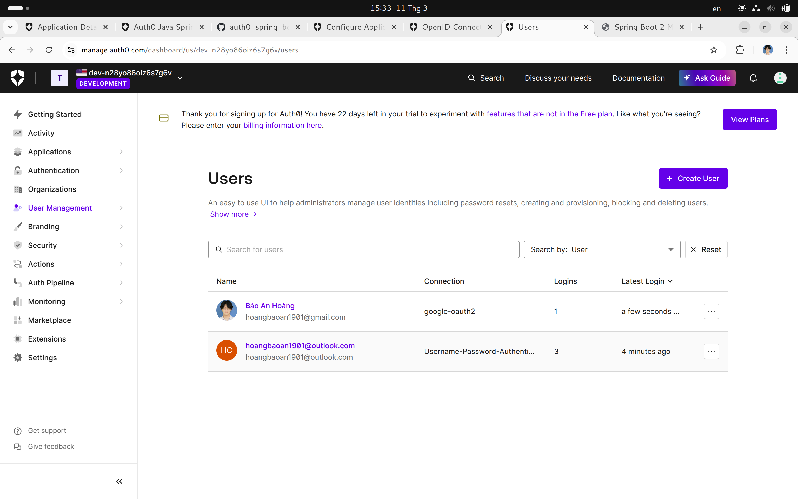