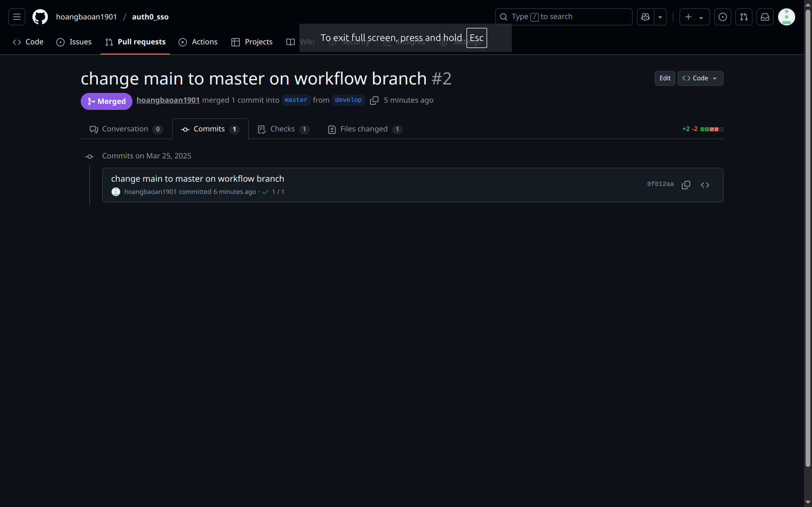
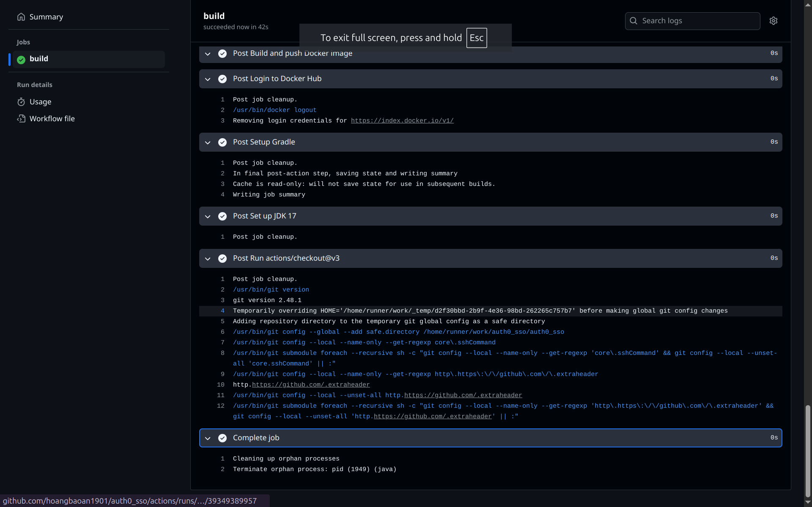
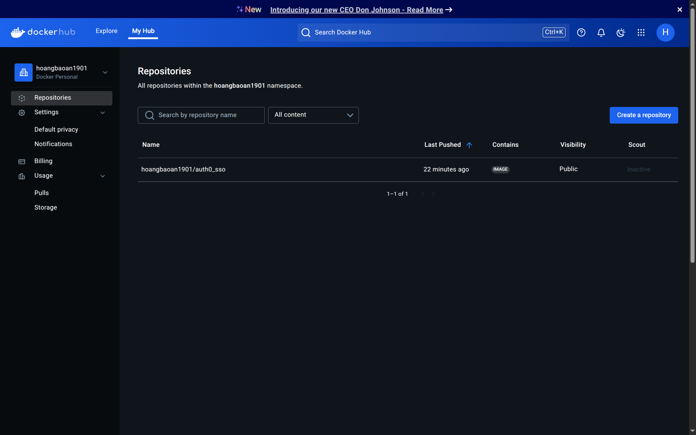
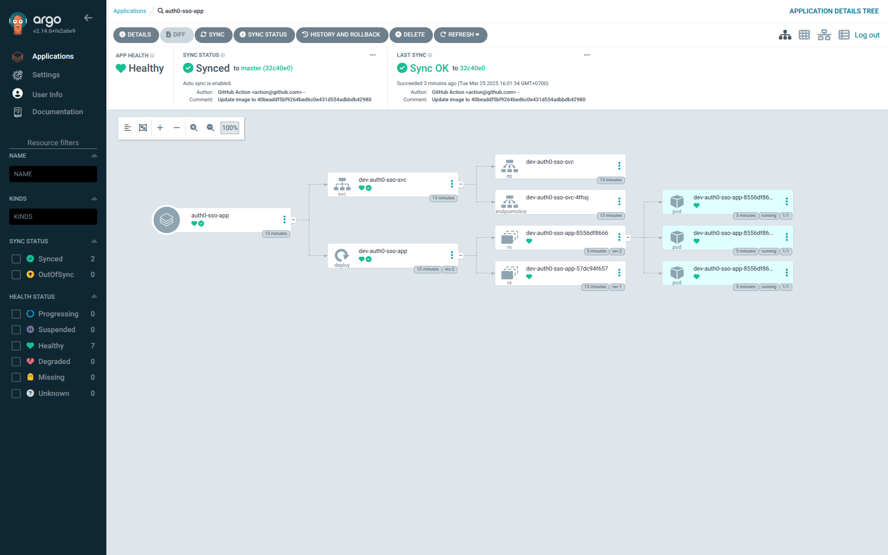
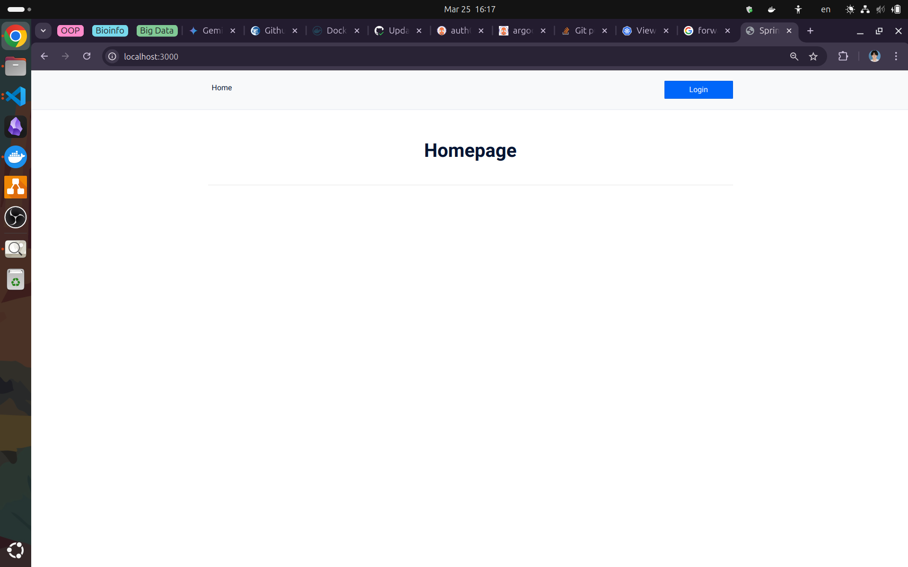
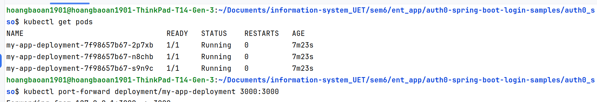

# Auth0 SSO with Spring Boot (with Docker and Kubernetes deployment, and CI/CD)

## CI/CD with Github Actions and ArgoCD (25/03/2025)
### CI with Github Actions
The project was build with `gradle`. So whenever the source code is commited to the `master` branch, we had need to proceed these steps:
- First, run `./gradlew build`
- Then, push create a docker container out of the JAR files we just made on the previous step and push to DockerHub.
These step can be automized through Github Actions. The workflow is written in `./.github/workflows/gradle-docker.yml`.
#### New pull request from `development` to `master`

##### Workflow completed

##### New image update on DockerHub

### CD with Argo
First, we have to update the K8s manifest with Github Action by adding this to the workflow 
```yaml
    # Update Kubernetes manifests
    - name: Update Kubernetes resources
      run: |
        sed -i "s|image: hoangbaoan1901/auth0_sso:latest|image: hoangbaoan1901/auth0_sso:${{ github.sha }}|" k8s/base/deployment.yaml
    
    # Commit and push the updated manifests
    - name: Commit files
      run: |
        git config --local user.email "action@github.com"
        git config --local user.name "GitHub Action"
        git add k8s/base/deployment.yaml
        git commit -m "Update image to ${{ github.sha }}" || echo "No changes to commit"
        git push
```
To activate ArgoCD, we need to declare these variables to `argocd-application.yaml` to sync the git repo with local ArgoCD app
```yaml
  source:
    repoURL: https://github.com/hoangbaoan1901/auth0_sso.git
    targetRevision: master
    path: k8s/overlays/dev
```
Additional configs are added add `k8s/overlays/dev`

Results:



To access the web, forward the port of the service using `kubectl port-forward svc/dev-auth0-sso-svc 3000:80`

## Docker and Kubernetes deployment (17/03/2025)
### Docker
#### Build with Gradle and Docker

Image will shows up in Docker Desktop

####Run container on Docker Desktop
Forward the exposed port (3000)


### Kubernetes
#### Enable Kubernetes on Docker Desktop

#### Create `deployment.yaml` and deploy on Kubernetes
```yaml
apiVersion: apps/v1
kind: Deployment
metadata:
  name: my-app-deployment
spec:
  replicas: 1
  selector:
    matchLabels:
      app: my-app
  template:
    metadata:
      labels:
        app: my-app
    spec:
      containers:
        - name: my-k8s-app-container
          image: spring/auth0_sso-docker:latest
          imagePullPolicy: Never
          ports:
            - containerPort: 3000
```
Note: use `imagePullPolicy: Never` to declare that the image is pulled from local docker, not Docker Hub.


#### Load Balancing & Service Discovery
Use `replicas: 3`

To forward port, use `kubectl port-forward deployment/my-app-deployment 3000:3000`, this allows forward port from any of the replicas.


Result

## 1. Homepage

## 2. Login page with Auth0 service

## 3. Sign up


### Through Gmail


## 4. Homepage after sign in

## 5. Profile page

### With Gmail

## 6. User management
